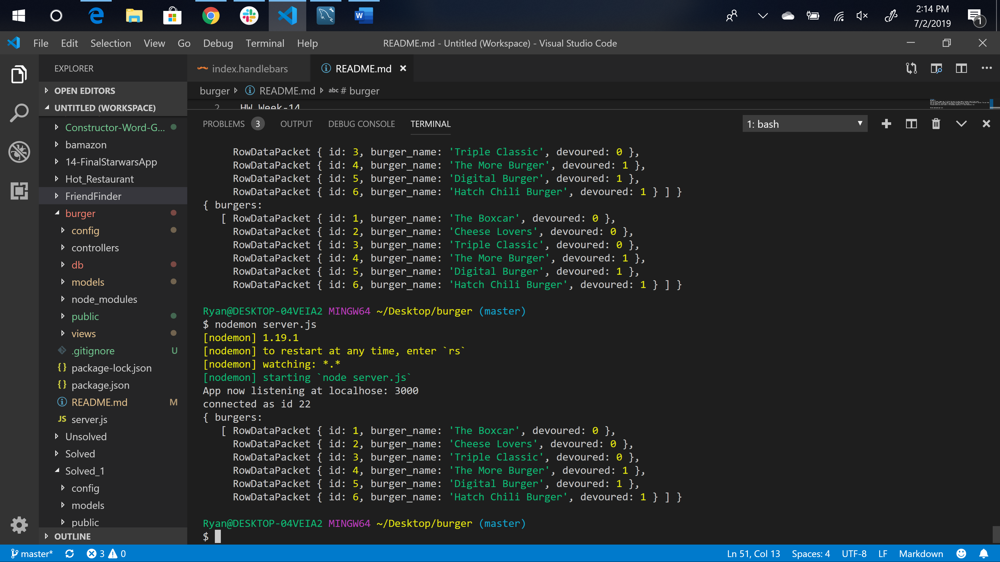

# burger
HW Week-14

Overview: 

This is a burger logger app. It allows the users to input names of burgers they'd like to eat. 
Once the user submits a burger name it should be displayed in the "waiting to be devoured" section. The user then hits the "Devour it" button and it should move it to the "devoured" section. 
The app should store each burger in the database regardless it's been devoured or not. 

Heroku deployed app link: https://shielded-tor-39212.herokuapp.com/

Issues: 
1.) index.handlebars -- when trying to create the two collumns for the "waiting to be devoured" and "These Burgers have been devoured". These handlebars in particular seem to break the code and cause an error. 

2.) Home page -- form / input fields don't display correctly. 

Home page displays.

Data from burgers_db displays in the terminal. 

Tech Used: 

    1. Node.js 
    2. Express.js 
    3. Handlebars 
    4. ORM
    5. MySQL Workbench 
    6. Heroku
    7. Node_Modules: express, path. 

Built With: 

    VS Code 

Authors: 

    Ryan Fogle 